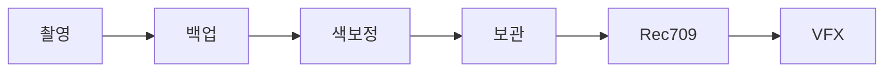
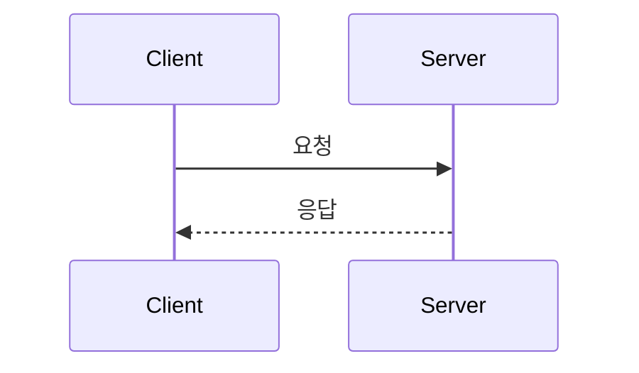
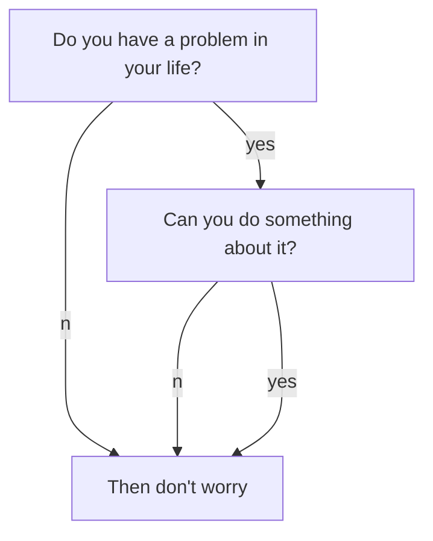
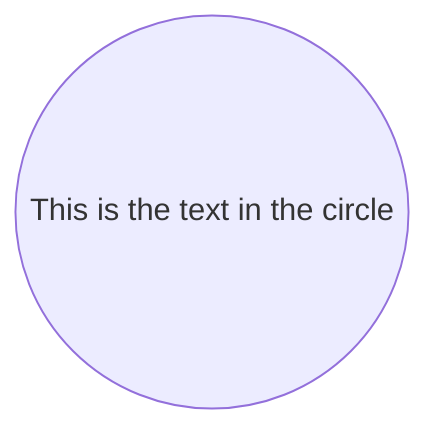

불방의 워크플로우를 안내합니다.  

---

*불방은 아래와 같이 작업합니다.*







```chart
{
  "type": "polarArea",
  "data": {
    "datasets": [
      {
        "data": [
          11,
          16,
          7,
          3,
          14
        ],
        "backgroundColor": [
          "#FF6384",
          "#4BC0C0",
          "#FFCE56",
          "#E7E9ED",
          "#36A2EB"
        ],
        "label": "My dataset"
      }
    ],
    "labels": [
      "Red",
      "Green",
      "Yellow",
      "Grey",
      "Blue"
    ]
  },
  "options": {}
}
```

```
sequenceDiagram
Alice->John: Hello John, how are you?
loop Every minute
  John-->Alice: Great!
end
```


