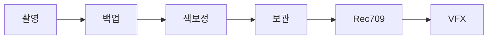
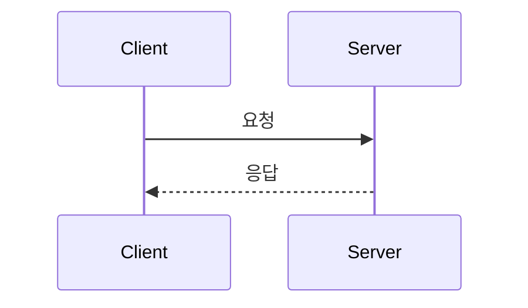
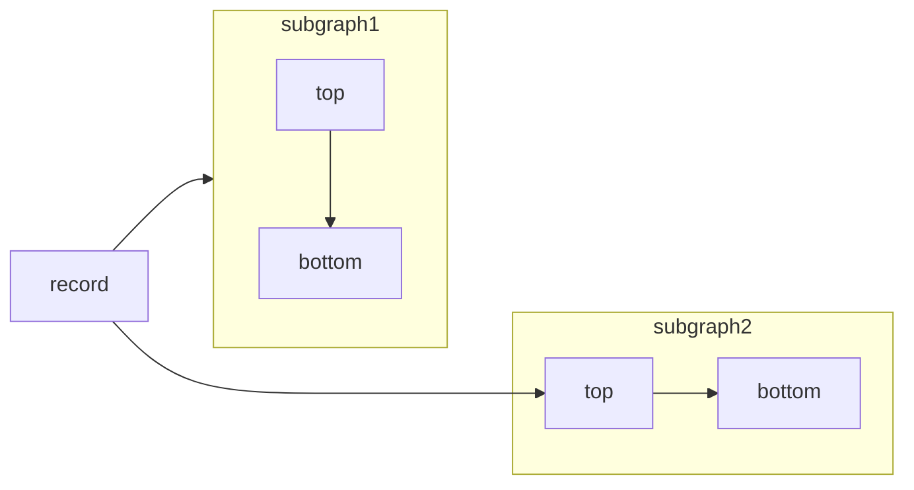

불방의 워크플로우를 안내합니다.  

---

*불방은 아래와 같이 작업합니다.*


```mermaid
graph LR
  A[촬영] --> B[백업]
  B --> C[색보정]
  C --> D[보관]
  D --> E[Rec709]
  E --> F[VFX]
```


```mermaid
sequenceDiagram
  participant Client
  participant Server
  Client->>Server: 요청
  Server-->>Client: 응답
```


```mermaid
flowchart LR
    subgraph subgraph1
        direction TB
        top1[top] --> bottom1[bottom]
    end
    subgraph subgraph2
        direction TB
        top2[top] --> bottom2[bottom]
    end
    %% ^ These subgraphs are identical, except for the links to them:

    %% Link *to* subgraph1: subgraph1 direction is maintained
    record --> subgraph1
    %% Link *within* subgraph2:
    %% subgraph2 inherits the direction of the top-level graph (LR)
    record ---> top2
```

```text
sequenceDiagram
Alice->John: Hello John, how are you?
loop Every minute
  John-->Alice: Great!
end```
