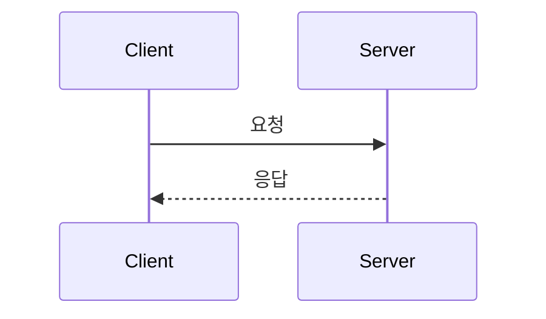

불방의 워크플로우를 안내합니다.  

---

*불방은 아래와 같이 작업합니다.*

```mermaid
graph LR
  A[촬영] --> B[백업]
  B --> C[색보정]
  C --> D[보관]
  D --> E[Rec709]
  E --> F[VFX]
```

```mermaid
sequenceDiagram
  participant Client
  participant Server
  Client->>Server: 요청
  Server-->>Client: 응답
```